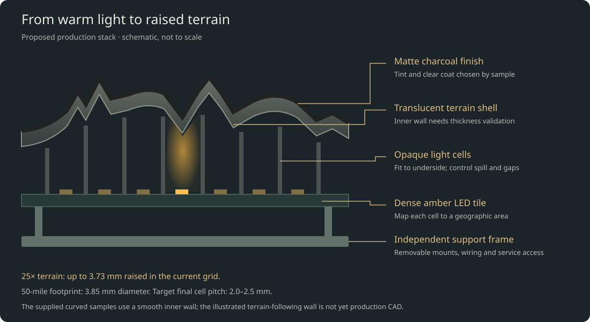

# Building the travel globe

> Earlier study: the current A0 geometry, parts and release holds are in [engineering-report.md](engineering-report.md). Use that report for fabrication planning.

**Design brief: 305 mm sea-level diameter · 25× real terrain · 50-mile visited-area radius · dark charcoal surface · warm amber light.**

The recommended route is a serviceable, internally illuminated globe with a thin terrain shell, separate optical cells to limit light spill, and dense LED boards. Store the visited places independently of the physical LED layout. Start with a small illuminated sample; release the full shell and custom electronics only after it passes the tests below.

This package provides a detailed design and checked prototype test files. Full-globe production CAD, custom electronics and device firmware will follow the measured sample results; print material and supports need the service’s review.

[Open the simulator](index.html) · [Explore the structure in 3D](structure.html) · [Save the PDF guide](build-guide.pdf) · [Download the build package](prototype-kit.zip) · [Design calculations](engineering/calculations.json) · [Parts and quote checklist](engineering/prototype-bom.csv)

## 1. What we are designing for

| Requirement | Design target |
| --- | --- |
| Globe size | 305 mm diameter at sea level; room for the exaggerated mountains outside that sphere |
| Surface | Real ETOPO-derived terrain, 25× vertical exaggeration; smooth oceans |
| Travel display | Union of approximate 50-mile-radius footprints around saved places; no inferred routes or country fills |
| Appearance | Charcoal matte when off; warm amber/gold visited regions; mountains remain recognizable |
| Geographic resolution | Small regions within countries remain distinct; nearby visits may merge |
| Persistence | A successfully saved destination survives loss of power; a interrupted save recovers the last valid history |
| Updates | Local phone/computer interface, plus documented JSON upload/export; no subscription |
| Longevity | Replaceable lighting modules, removable shell sections, replaceable external supply, offline backups |
| First acceptance distance | Judge appearance at 0.5–1 m, then inspect close up; use normal room lighting as well as a dim room |
| Initial fabrication | Print service, preassembled boards, basic soldering and mechanical assembly |

**The 50-mile preference stays the command radius.** We will measure the actual illuminated patch after printing. We will not conceal poor resolution by silently changing the stored visit radius.

### The two dimensions that matter most

At this scale, 50 miles corresponds to **1.926 mm radius**, or **3.852 mm diameter**. A nearby pair of cities can legitimately merge into one small patch.

The current elevation grid's highest sample is 6,229 m. At 25×, it becomes **3.728 mm of raised terrain**. A shell with a smooth inside and a 1 mm base wall can therefore become **4.728 mm thick radially** under its highest sampled mountains. That thickness is an optical problem worth testing before a large print order.

The full geometric envelope is bounded by about **312.5 mm**, although opposite points do not both sit at the highest elevation. Allow this envelope in the stand and packaging. If we later change to finer terrain data, we must recalculate it: a preserved 8,849 m summit would rise about 5.30 mm at 25×. Do not change terrain datasets halfway through manufacturing.

## 2. The architecture I recommend

A modular, rear-lit shell is the leading architecture. The full-globe lighting needs custom preassembled boards; the first optical experiment can use an existing assembled matrix.

From outside to inside:

1. A thin, compatible matte clear finish.
2. A controlled translucent charcoal tint over land; an opaque ocean mask where desired.
3. A printed translucent terrain shell.
4. A very small, measured gap or replaceable soft sealing interface.
5. Opaque light cells/baffles that keep one lit area from flooding its neighbors.
6. Small LED boards, mapped to actual geographic positions.
7. A separate structural frame carrying boards, wiring and shell mounts.

The [interactive structural study](structure.html) adds assembled, cutaway, exploded, frame-only and small-prototype views. It shows proposed space allocations and layer relationships. The terrain samples are printable; the complete frame joints, carrier brackets, shell mounts, optical cells and electronics remain to be engineered. The full-globe LED dots are representative, not the final pitch or population.

**The terrain shell does not carry the globe's weight.** Mounts and a frame do that. The electrical and optical assemblies should come apart without destroying the finished exterior.

For the final light source, prefer **monochrome amber LEDs** if one tested amber wavelength gives the desired appearance. They avoid paying for and powering three channels at every location. Buy enough of one optical bin/lot for the whole globe plus spares. If the coating makes monochrome amber too orange, or adjustable gold is important, use a tested two-color amber/warm-white or RGB implementation and recalculate every channel, power, and cost estimate.

A monochrome driver bank does not require a tiny controller inside every LED. That matters: thousands of addressable RGB packages can consume substantial power even when their colors are set to black. Measure idle current rather than assuming sparse visits make the whole globe low power.

### Why not use the earlier strips?

A 144-LED/m strip has roughly 6.94 mm longitudinal spacing, already larger than a 3.85 mm footprint. The earlier six-strip layout is coarser still in its other direction. It is useful for trying color or tint, but it is **not the recommended resolution test or final construction**.

### Why not wrap a large flexible matrix around it?

A sphere curves in two directions. A flexible rectangular PCB generally bends easily in one direction but cannot cover a sphere without stretching, wrinkling, cuts, or segmentation. Narrow flex gores are an alternative development project, not something to assume will fit because a vendor calls a panel flexible.

### Why not put one projector inside?

Projection is attractive for resolution, but a full sphere needs suitable optical coverage, focus over different distances, alignment, and management of supports and shadows. The raised translucent surface adds another optical variable. It is not the simplest route to a quiet, repairable, one-foot object. Revisit projection if dense LEDs fail the optical test; do not promise a one-projector solution now.

## 3. Lighting resolution and full-globe complexity

These are equal-area square-cell estimates, not a finished PCB layout. Oceans occupy roughly 71% of Earth, but coastline margins, board packing, seams and small islands prevent the land-area column from being a final purchasing quantity.

| Nominal cell pitch | Cells across one 50-mile footprint | Whole-sphere area / pitch² | Land-area lower-bound estimate |
| --- | ---: | ---: | ---: |
| 2.0 mm | 1.93 | 73,062 | 21,188 |
| 2.5 mm | 1.54 | 46,759 | 13,560 |
| 3.0 mm | 1.28 | 32,472 | 9,417 |
| 6.94 mm | 0.55 | 6,060 | 1,757 |

**Design toward 2.0–2.5 mm effective surface pitch.** Treat 3 mm as a readily available first test and a possible compromise only if the physical result is satisfying. Even 2 mm gives only about two samples across an isolated footprint; this is an approximate regional display, not a sharp little geographic screen.

A 3 mm matrix that looks good is useful evidence. It does not establish that a lower-density strip will look equally good. Conversely, if one isolated visit disappears between 3 mm emitters, it is a reason to test finer pitch—not to light the entire country.

The mapping must sample coverage over each cell's area, rather than checking only its center. Otherwise a small footprint can vanish between emitters. Store the geographic footprint first, then calculate light levels for the installed layout. Neighboring footprints combine by maximum/union, so overlapping visits do not become artificially brighter.

### Provisional full-globe segmentation

Use small, approximately planar electronics tiles on a spherical internal frame, with individually shaped optical baffles between each tile and the shell. An icosphere with 320 triangular faces is a useful mechanical starting study because its facets are small; it is **not a released 320-board shopping list**.

Populate land-bearing areas and coastal margins; use structural blanks over deep ocean. The final tessellation, LED placement, coastline margins, small-island coverage and mechanical shadows must be computed together. About 25,000–40,000 monochrome emitters is a planning range for a fine land-focused implementation, not a verified final count. Cost the all-surface alternative as an upper comparison.

The custom-board designer should aim for repeated PCB shapes, modest numbers of distinct assembly variants, and connectors accessible from the inside. Avoid a different unique PCB design for every geographic patch. Geography belongs in the mapping file and optical shell.

Require an **actual pixel-to-surface map** before releasing electronics: panel ID, driver ID, electrical channel, LED center, surface intersection, latitude/longitude, optical-cell boundary, calibration gain, and valid/blocked status. Include seams, mounting ribs and coastline masks in the coverage audit. Software cannot illuminate an island for which no physical light path exists.

## 4. Build the optical prototype first

The most useful first purchase is one assembled dense matrix, not enough LEDs for the whole globe.

### Reference prototype electronics

**Adafruit IS31FL3741 13×9 RGB matrix, product 5201**, is a verified starting board. Its open hardware documentation specifies 117 RGB LEDs at **3 mm pitch**, with 8-bit PWM per color element, adjustable global current, I²C, and a 3.3–5 V supply.

The checked PCB revision has a **39 × 51.08 mm board outline**. The nominal active cell area is **39 × 27 mm**, with LED centers spanning **36 × 24 mm**. Do not confuse the board outline with its illuminated area or order a 39 × 27 mm enclosure for the entire board.

Use an **Adafruit QT Py ESP32-S3, product 5426**, as a compact prototype controller. The checked board documentation describes Wi-Fi, native USB, 8 MB flash and 512 KB SRAM, without PSRAM. It is sufficient for a small matrix experiment and a modest local update interface; it is not yet the full globe's final electronics design.

These are actual identified parts. Availability and delivered prices have not been verified. The electrical reference design, rather than a shop description alone, determines the wiring.

### A crucial wiring detail

The checked matrix schematic connects SDA and SCL pull-ups to the matrix supply. **If the matrix is powered at 5 V, its I²C lines must not connect directly to ESP32 GPIO.** This is why the recommended 5 V bench arrangement includes a bidirectional I²C level shifter.

Use an [Adafruit 757](https://www.adafruit.com/product/757) BSS138 I²C level-shifter breakout with separate LV/HV references and pull-ups; confirm its supplier documentation. A 74AHCT125 strip-data buffer is not a replacement for a bidirectional I²C shifter.

| Connection | Bench arrangement |
| --- | --- |
| Controller power | USB from the programming computer |
| Matrix VCC | Separate regulated, enclosed 5 V supply, initially current-limited where possible |
| Matrix GND | Supply ground and controller ground |
| Level shifter LV | Controller 3.3 V |
| Level shifter HV | Matrix 5 V |
| Level shifter GND | Shared ground |
| Controller SDA/SCL | Low-voltage side of the two I²C channels |
| Matrix SDA/SCL | Corresponding high-voltage side |
| Optional matrix shutdown | Leave as the documented board default initially; add a properly level-compatible hardware blanking control later |
| Power positives | Do not join the external matrix 5 V to the controller's USB supply |

Use the board's documented STEMMA/QT I²C port in firmware and verify the actual pin labels. Do not assume the controller's edge-header I²C pins and QT connector use the same bus. A normal four-wire plug-to-plug cable bypasses the needed level shifting in this 5 V arrangement; use breakout leads or an interposer.

Keep bench I²C leads around 100 mm where practical and begin at 100 kHz. With power applied and no bus traffic, measure about 3.3 V on the controller-side SDA/SCL and about 5 V on the matrix side before connecting the controller.

Start with low global current and one dim pixel. A protected 5 V, 2 A adapter is a reasonable bench supply class, **not a statement that this board may safely consume 2 A**. Use a temporary 0.5 A branch fuse or a current-limited bench supply, and verify actual board current/temperature before increasing brightness. Resolve repeated fuse trips rather than substituting a larger fuse.

### Prototype shopping and quote list

Planning allowances in USD, not live prices:

| Item | Quantity | Allowance | Release condition |
| --- | ---: | ---: | --- |
| Adafruit 5201, assembled 13×9 matrix | 1 | $25–45 | Confirm exact board and revision |
| Adafruit 5426, QT Py ESP32-S3 | 1 | $15–30 | Confirm matching USB cable |
| Adafruit 757 I²C level-shifter breakout | 1 | $5–12 | Verify LV/HV topology and pull-ups |
| Enclosed regulated 5 V supply, leads, fuse holder/fuse | 1 set | $20–40 | Correct polarity; no exposed mains |
| Breakout leads, spacers, screws, temporary clamps | 1 set | $15–35 | No load on USB/QT connectors |
| Translucent coupon and curved-shell print batch | 1 batch | $50–150 | Quote approved material and supports |
| Compatible smoke tint, matte clear, diffuser samples | Small samples | $15–35 | Service confirms compatibility |
| Calipers, multimeter, contact temperature probe | Borrow if possible | $0–80 | Needed for measurements |

The table totals roughly **$145–427** before tax/shipping. A sensible first-stage allowance is **$200–400**, depending on tools and print-service minimums. Do not buy full-globe quantities yet.

### Printable test pieces included

The build package's engineering folder contains:

- Four 30 × 30 mm flat coupons, at 0.6, 0.8, 1.0 and 1.2 mm thickness.
- A smooth curved shell at the globe's real radius, nominal 39 × 27 mm.
- A Vancouver terrain shell over the same area, at 25× elevation, with a 1 mm radial base wall.
- A second terrain shell centered on the Himalayas, to challenge the stack with much taller land.
- A land-clipped, area-sampled 13×9 Vancouver test pattern and scale calculations.
- A dim, manually selected CircuitPython bench-pattern utility with setup instructions; it is not the final device firmware and has not run on physical hardware.

The terrain coupon's actual bounding box is about **39.14 × 27.22 × 3.98 mm**. The smooth coupon is **39.00 × 27.00 × 2.83 mm**. Both are closed meshes; they have no fitted mounts, supports or baffles. They are optical test pieces, not released pieces of the final enclosure. STL units must be interpreted as millimetres.

The smooth sphere drops about **1.86 mm** between the center and the 39 × 27 mm rectangle's corners. A flat display cannot therefore sit the same distance from every point of this curved shell. Hold the shell with adjustable edge spacers; begin around 0.5–1.0 mm clearance at its closest inside point, measure the resulting center gap, and avoid contact with LED packages.

Cover unused board regions with a removable opaque mask, keep vents and electronics unobstructed, and center the matrix's active region under the shell. Do not glue the coupon to the LEDs.

## 5. Qualify the surface and optical stack

### Material recommendation

Use a print service experienced with **translucent SLA/MSLA parts and optical appearance samples**. Ask for a tough, dimensionally stable resin with documented cure, finishing compatibility and indoor aging behavior. Do not choose ordinary brittle clear hobby resin solely because it is transparent.

The preferred surface is lightly diffusing, not crystal-clear. A clear window can reveal the individual LEDs; too much white pigment or diffusion can turn a small footprint into a large fuzzy blob.

FDM natural PETG is a cheaper comparison sample, but visible layer texture and inconsistent scattering may fall short of the desired object. Do not order the light-transmitting land surface in opaque black. Painting an opaque white print black does not create a good backlit display.

### Run the flat-coupon experiment first

For each practical thickness, compare:

1. Uncoated printed material.
2. A light translucent smoke coat.
3. A second controlled tint level.
4. The best tint with a thin compatible matte clear.

Label samples on removable tabs or their backs. Record print material, printer/process, layer height, orientation, cure, sanding, tint product, coat count and drying time. Keep one uncoated control.

If neutral-density film samples are available, 0.3/0.6/0.9 optical density corresponds nominally to about 50%/25%/12.5% transmission. They are useful controls, not a prediction that a charcoal coating will transmit amber the same way.

Try the screen's desired amber by eye under the final coating. A computer RGB value is not a physical wavelength specification. Later compare nominal 590–595 nm amber LED samples from a supplier against the RGB prototype. Commit to one color/bin only after that comparison.

### Then compare the curved pieces

Run identical patterns through the smooth and terrain shells at identical current and exposure. Compare mountain peaks with nearby valleys. Include the supplied Himalayan sample: a Vancouver-only test cannot establish performance under the globe’s highest terrain.

The supplied terrain shell has a smooth inside, so its raised land adds material. It is intentionally a useful test of the simple construction. If peaks go dark while valleys bloom, increasing every LED's current will not solve the underlying mismatch.

The preferred production investigation is a **terrain-following inner surface** that keeps optical wall thickness closer to constant. It needs proper CAD work: simply subtracting 1 mm from every radius does not guarantee a 1 mm wall measured perpendicular to a steep slope. A normal-offset surface can self-intersect in tight valleys. Smooth/filter only features that cannot satisfy a verified minimum wall, and show that revised geometry in the simulator before approval.

A production CAD release must include a thickness map and interference checks. A thinner shell is not automatically better if it is fragile, warps after curing, or produces visible LED dots.

### Light isolation

Test three conditions in order:

1. Bare matrix behind the coupon.
2. A thin diffuser at a measured location.
3. Opaque cell dividers between sources, with the diffuser close to the emitting surface.

For the 3 mm matrix, a starting divider-wall study is about **0.3–0.5 mm wall thickness** with apertures around **2.5–2.7 mm**. These are fabrication trial dimensions, not a released baffle STL. A service must confirm that the chosen opaque process produces continuous light-tight walls at those dimensions.

Baffle tops should follow the shell underside. A gap that leaks laterally defeats their purpose; hard contact that point-loads a fragile terrain shell is also undesirable. Investigate a thin compliant seal or controlled contact lands, while keeping the active aperture clear. Measure and prototype the actual assembled gap.

Avoid deep narrow tubes if possible: they discard light, make alignment harder and produce a visible honeycomb. If a flat board requires very long cells near a curved shell, use smaller boards or a different segmentation instead of making every tube longer.

### Acceptance tests before full-globe CAD

Use a fixed camera exposure for comparisons and a ruler in the same plane. Phone auto exposure can make two different stacks look equally bright.

| Test | Target or decision |
| --- | --- |
| Off-state appearance | Satisfying dark charcoal at normal room illumination, without obvious white plastic, pixels or grid |
| One visited place | Clearly visible local amber area, not a country fill |
| Isolated footprint size | Aim for roughly 3.5–6 mm apparent diameter; measure at half-maximum brightness where practical |
| Dark separation | Two commanded 50-mile footprints 8 mm apart should retain a visible dark gap |
| Spill | At a point about 6 mm from an isolated visit's center, aim for less than 10% of the patch's peak signal above background |
| Overlap | Nearby visits merge without a brighter seam or a connecting route |
| Terrain | The Rockies/coastal ranges read as terrain; peaks do not disappear because they are too opaque |
| Tint/current | Good color at a modest measured current, without a glowing white haze |
| Thermal trial | Surface below 40°C in a 25°C room as an initial comfort target; no material distortion |
| Repeatability | A second piece with the same process gives similar finish and transmission |

The numerical optical targets are **design acceptance targets, not measured results**. If the apparent footprint is consistently 7–10 mm, that represents a noticeably broader area than the simulator. Record it and decide explicitly whether it is acceptable before changing hardware density or the preview.

If 3 mm pitch passes the look test but an isolated place is poorly placed or disappears, commission one finer-pitch tile. If 2–2.5 mm pitch still fails through the chosen shell, fix the optics before scaling up.

## 6. Full shell, frame and mechanical design

### Exterior

Keep the approved 25× elevation mesh and the lighting map under revision control. The displayed coastlines and grid are simplified; they are adequate for a first regional object, but small-island completeness needs a deliberate check before final manufacture.

Ask for a finish sample in the exact final material. Specify outer surface quality before an invisible internal dimensional detail. Prefer support placement on inward surfaces or sacrificial mounting tabs, not mountain ridges.

Divide the exterior into removable sections sized for the selected printer and assembly access. Let the fabrication service and mechanical designer choose the final count after orientation, shrinkage, frame support and seam studies. **Eight to twelve external sections is a starting packaging concept**, not a frozen geometry; their boundaries need not match the smaller electronics tiles.

Place seams primarily in ocean regions where possible. Use a light-blocking internal overlap/labyrinth and registration features. Do not permanently bond every seam shut. Test a 0.15–0.30 mm visible joint study with the actual process rather than specifying an impossible zero-width seam.

Keep fasteners and locating features on hidden inward flanges. Small screws into separate inserts or nuts are preferable to repeated tightening into thin resin. Insert installation must not crack or distort the optical shell. Use one locating datum and allowances for expansion rather than over-constraining every edge.

### Frame and service access

Use an internal spine and removable carriers. The shell should locate onto these carriers while the frame supports gravity and handling. Route wiring along members and leave a service loop at each removable section.

Use keyed, labeled connectors and panel IDs that match the mapping file. Make it possible to replace one failed module without desoldering neighboring modules or removing every shell segment.

Maintain a keep-out envelope between the tallest component, connectors, baffles and shell. Include fastener heads, wire bend radius and strain relief, not just the PCB outline. Audit every mechanical obstruction against the light map.

### Stand

Use a weighted base, roughly 180–220 mm in diameter as a starting layout, with non-slip feet and a replaceable power connector. A charcoal body with restrained brass/amber details fits the visual direction.

Design tilt and service access before routing the cable. A fixed globe is the lowest-risk first build. If hand rotation is desired, use bearings with a controlled rotation range, mechanical stops and a protected cable loop. Unlimited rotation needs a properly rated slip ring and introduces another wear component; a motor is unnecessary for the first version.

Account explicitly for any support opening near the south pole. It is a real non-display region and should appear in the physical coverage map rather than being hidden by software claims.

Stability must be calculated from the measured completed mass and center of gravity. As an initial check, a 2.2 kg object on a 200 mm diameter base resists roughly 5.4 N of horizontal force applied 400 mm above the support plane before idealized tipping. This ignores sliding and mounting compliance. Test the actual assembly with a controlled gentle force; do not rely on that example if the globe or base weights change.

## 7. Full-globe electronics

### LED boards

A custom monochrome matrix around an **IS31FL3741-class driver** is a credible starting point. The checked Adafruit implementation addresses 351 monochrome channels and provides global current, per-channel scaling, PWM, reset and output enable. Those capabilities suit a slowly updated travel display.

This is **not approval to copy a board and substitute amber LEDs blindly**. The PCB engineer must verify the manufacturer's current datasheet: scan arrangement, peak versus average LED current, current-setting resistor, compliance voltage, LED pulse rating, thermal limits, decoupling, reset behavior and failure states. The direct datasheet was inaccessible in this research environment, so those details remain procurement/release checks.

The prototype board's RGB channel mapping and current resistor values are not automatically correct for a full amber panel. Order assembled boards; thousands of tiny LED joints are not an appropriate hand-soldering task.

Freeze LED orientation, bin, resistor values, driver revision, connector orientation and test points before a production lot. Supply a factory test pattern that lights each channel in turn, tests all-off leakage, verifies communication and records panel current.

### Control network

One Wi-Fi controller owns the travel history and exposes the user interface. For the production main board, prefer an ESP32-S3 variant with external PSRAM and enough flash for A/B firmware plus separate history, mapping and calibration partitions; 8 MB PSRAM and 16 MB flash are useful design targets to verify against the selected module. The no-PSRAM QT Py is the bench controller, not a frozen full-globe memory configuration. For the finished globe, use several local sector controllers so long wiring runs do not turn a large I²C bus into an intermittent display.

A practical starting topology is one main ESP32-S3 plus four sector controllers. Connect sectors using a properly designed differential link such as RS-485, with addressed packets, CRC, acknowledgments and retry limits. Select a transceiver compatible with the logic rail; the final schematic must specify termination, biasing, ESD protection and grounding.

Each sector has short local I²C branches to its driver boards. Address multiplexers can separate repeated driver addresses and reduce connected capacitance. The reference matrix supports four addresses; an eight-channel multiplexer can select branches containing up to four distinct addresses, subject to actual board electrical loading. A multiplexer is not a magic cure for long wires or excessive pull-ups.

The complete network must be checked with an oscilloscope for rise time, logic levels, noise and recovery at the selected bus rate. Start conservatively. This display changes when travel history or brightness changes; it does not require video bandwidth.

A transfer of 25,000 one-byte brightness values takes at least 2.25 s at 100 kbit/s I²C before register/page/branch overhead. Sectoring and selective updates help. Target an acknowledged update within about five seconds; do not advertise instantaneous full-frame changes before measuring the actual topology.

### Power distribution

Keep mains outside the object in a certified enclosed adapter. Distribute a higher low voltage, provisionally **12 V**, through separately protected branches, and regulate locally near LED sectors. The final supply size follows measurement; an adjustable 30–60 W class architecture provides development headroom but is not permission to dissipate that much continuously inside a closed globe.

With 20,000 active amber LEDs, average current per LED gives the following lower-order rail estimates:

| Average current per LED | LED rail current | Power at a 3.3 V LED rail |
| --- | ---: | ---: |
| 0.05 mA | 1 A | 3.3 W |
| 0.10 mA | 2 A | 6.6 W |
| 0.20 mA | 4 A | 13.2 W |
| 0.50 mA | 10 A | 33 W |

For 40,000 active emitters, double the LED figures above. These exclude controller/driver idle current, regulators and wiring losses. They are **average currents through LEDs**, not the multiplexed driver's instantaneous setting. Include scan duty cycle, PWM and worst-case enabled channels when specifying peak current.

Aim for roughly 10–15 W or less in the eventual normal indoor display, then measure whether the optics make that feasible. Full-land service-test mode must be subject to a measured power cap. Do not base wire sizing on the optimistic assumption that only Vancouver will ever be illuminated.

Use branch protection and connectors rated for the actual worst-case current. Calculate voltage drop using the complete outgoing and return path: voltage loss is current times total resistance. Keep LED power out of development-board USB traces and small signal connectors.

Provide hardware blanking/current limiting and sensible protection independent of ordinary brightness software. If firmware crashes or a driver powers up incorrectly, the result should not be an unbounded full-current display.

### Thermal design

Design for passive cooling first: low operating power, a conductive support path, and discreet ventilation where it does not create light leaks. Add temperature sensing near a representative warm LED region and near the power conversion electronics.

Measure at least all-off, typical travel history, a dense visited region and a current-limited all-land test. Log supply current and temperatures for at least two hours or until stable. Test the finished tinted shell, not an open frame only.

Use the actual resin/coating's service temperature and component derating curves. A comfort target of 40°C at the outer surface is not the only limit. Program a lower brightness ceiling or thermal shutdown well below the lowest material/component limit after measuring the warmest locations. Avoid rapid thermal on/off oscillation.

A fan is a fallback, not the default aesthetic. If the desired finish demands too much power, improve transmission or lower internal losses before hiding the problem with a fan.

## 8. Phone updates, storage and software

### What the user should experience

1. Power on: the globe shows the last saved places without requiring internet.
2. Open its local page on a phone/computer on the same network.
3. Add a named location, using latitude/longitude or a deliberate map/geocoder selection.
4. Preview its approximate footprint; save.
5. The globe acknowledges the saved revision and updates its light map.
6. Export a backup whenever desired.

The public GitHub Pages simulator is a design tool. It is not currently connected to a globe. The device will serve its own interface, for example at a local hostname with an IP-address fallback. A public HTTPS page cannot simply be assumed to control an HTTP device on a private LAN; browser security and discovery need deliberate handling.

### Data model

Preserve the existing version-2 travel import/export format: version, radiusMiles, and an array of named latitude/longitude places. Internally add stable IDs, a revision counter, schema version and checksum. Keep hardware panel mapping and brightness calibration in separate versioned files.

Terrain exaggeration is a **manufacturing setting** once the shell exists. Changing a screen slider does not change a printed mountain. The device's actual shell revision should identify the 25× terrain dataset and geometry.

Do not silently change the meaning of existing visits when installing new LED boards. Re-render the same stored geographic footprints through the replacement board's mapping.

### Persistence that actually survives unplugging

Use a transactional two-slot record scheme:

1. Validate the complete proposed history and size limits in RAM.
2. Write it to the inactive slot with its revision, length and checksum.
3. Commit/flush and read it back.
4. Only then acknowledge success to the phone.
5. On boot, choose the newest complete, valid slot; retain the older slot until a later successful write.

The precise implementation may use an appropriate flash filesystem plus a small NVS manifest, or bounded NVS blobs after checking partition and RAM limits. Do not treat two sequential ordinary file writes as automatically atomic.

Espressif documents NVS recovery under power interruption, with the newly written key/value potentially lost if power is removed during its write. An application-level validated previous record and read-back acknowledgment are still valuable. Write flash on changes, not every display refresh.

Test interruption during each save phase and during firmware update. A save that was acknowledged must remain present after unplugging. An interrupted, unacknowledged save may recover either the old or new complete revision, but never a half-parsed history.

### Network and maintenance

Use a physical setup action and a unique setup/edit credential. Provision onto the home network, then stop exposing an indefinite open setup access point. Keep updates local by default; do not require port forwarding, cloud accounts or a subscription.

Validate input sizes and coordinate ranges, reject malformed data without erasing current history, and require deliberate confirmation for clearing history. Protect write endpoints against unauthenticated or cross-site requests. Keep a USB recovery path.

Use firmware A/B updates with rollback where supported. Do not put travel data in a partition overwritten by firmware flashing. Test upgrade and downgrade handling of stored schema versions before handing over the finished device.

An illustrative eventual API is GET /api/project for export and authenticated PUT /api/project for a complete validated replacement. Its response should include the committed revision/checksum. This API and the device firmware are design requirements, not implemented functionality in the current simulator.

## 9. Calibration and geography

Assemble and calibrate by panel ID, not by guessing LED order.

1. Photograph or inspect each tile's sequential single-pixel test.
2. Record its installed transform relative to the globe coordinate frame.
3. Map each emitter's effective surface cell into latitude/longitude.
4. Apply the land/ocean and mechanical-obstruction masks.
5. Render known calibration locations near the equator, mid-latitudes and high latitudes.
6. Check hemispheres, longitude sign, pole handling and the date line.
7. Measure cell brightness/color through the actual finished shell.
8. Apply bounded gain corrections; reduce bright cells rather than driving weak ones past current/thermal limits.

Calibrate the geographic frame using at least three well-separated recognizable features, and verify additional features. The axes must remain consistent after a shell section is removed and reinstalled.

Include Vancouver alone, separated western North American visits, overlapping Bay Area visits and a date-line case in acceptance tests. Montreal, Edmonton and South Dakota must remain dark for a Vancouver-only history. Add small islands to the final hardware coverage audit; a simplified land polygon can otherwise erase them even if the electronics are dense enough.

The baffle and diffusion stack creates an optical point-spread function. Measure it with a single lit cell. Use that measurement when predicting isolated footprints; the simulator's current coarse-LED comparison is not an optical model.

## 10. Assembly sequence and release gates

| Stage | Build | Evidence needed to continue |
| --- | --- | --- |
| A | Flat material/tint coupons and the reference matrix | Dark off-state, acceptable amber transmission, known current |
| B | Smooth and 25× curved coupons, spacing and baffle trials | Recognizable footprint, controlled spill, acceptable terrain brightness |
| C | One custom fine-pitch tile with its actual baffle and shell mount | Real driver/current behavior, reliable mapping, factory assembly quality |
| D | Two adjacent tiles and one shell joint | Seam appearance, no shadow band, no bright seam, repeatable reassembly |
| E | One complete serviceable sector with local controller | Power distribution, noise, temperature, update and power-loss tests |
| F | Full frame, limited initial population, then remaining sectors | Stable mechanics, correct geographic registration, accessible repair paths |
| G | Final finish, calibration and endurance testing | Appearance and reliability accepted together |

Do not finish-paint all shell sections before the two-section test. Do not buy a full LED lot before confirming optical bin, pitch, driver settings and the factory test process. Do not glue the final shell closed before the endurance and serviceability tests.

A plausible personal-project sequence is several prototype/quote iterations over weeks to months, not a weekend build. Supplier lead time and access to PCB/CAD expertise dominate. The elapsed time is uncertain until the optical result and budget are known.

## 11. Budget and who does what

No budget was available when this package was drafted. The following is a planning envelope, not a quote or authorization to purchase.

| Full-globe work/material | Planning allowance |
| --- | ---: |
| Shell printing, samples, finishing iterations | $300–900 |
| Custom preassembled LED/driver tiles and spares | $500–1,500 |
| Frame, baffles, mounts and weighted base | $200–700 |
| Controller/sector electronics, power, harnesses, connectors | $200–500 |
| Contingency and failed iterations | $300–900 |
| **Materials/services subtotal** | **$1,500–4,500** |

Professional mechanical/optical/PCB design labor is additional and can add several thousand dollars. That work is not included in a print quote. Prices could move substantially after the tile count and fabrication process are frozen.

For a much lower budget, keep the same 50-mile data model but explicitly reconsider optical pitch, finish, display coverage or assembly ambition after the sample. Do not describe a coarse display as equivalent to the accepted simulator.

Your practical role can be selecting the finish, running sample tests, plugging in preassembled modules, basic soldering, mechanical assembly and maintaining the history. The service should handle high-quality thin-wall printing and finishing. A PCB assembly provider should handle fine-pitch soldering. A qualified electronics/CAD designer should release the custom circuit and production geometry.

### What remains before a full-globe order

- Accepted material, tint, diffuser and measured light spread.
- Final pitch, LED color/bin, peak/average current and power limits.
- Full surface-to-panel mapping, including small islands and support shadows.
- Production CAD, wall-thickness analysis, seam/mount details and tolerances.
- Reviewed schematics, PCB files, BOM, harness drawings and factory test procedure.
- Device firmware, local update interface, power-loss recovery and recovery flashing procedure.
- A measured thermal and stability result from the assembled sector.

Those are concrete deliverables, not details to leave to chance during final assembly.

## 12. Print-service request you can copy

> I am developing a 305 mm illuminated terrain globe and want a small optical/material test batch first. Please quote the included 30 × 30 mm coupons at 0.6/0.8/1.0/1.2 mm, plus the smooth, Vancouver and Himalayan curved shells. STL units are millimetres; do not resize. The terrain sample uses 25× elevation and has roughly 39.14 × 27.22 × 3.98 mm bounds.
>
> I need a lightly translucent, tough, stable material suitable for indoor backlighting, with a pleasing matte charcoal-tinted off-state and amber transmission when illuminated. Please recommend a resin/process and provide its material data, minimum reliable wall, cure/post-process requirements, dimensional tolerance, expected warping and coating compatibility.
>
> Please keep support marks off the outward display surface where practical, document orientation/layer height/cure, and leave samples uncoated unless we separately agree on a labeled finish trial. These are optical test pieces, not a structural enclosure. Please flag unsupported thin features or damage risks before manufacture and quote a repeat batch using the same process.

## 13. Evidence, files and honest limits

Reference hardware facts were checked against Adafruit's open schematics, board files and library code. Controller storage/update behavior was checked against Espressif documentation. Manufacturer shop pages and several direct datasheet URLs were blocked by the research environment, so current availability/prices, selected resin performance, and the final driver's electrical limits are not independently verified here.

See [the hardware source record](hardware-sources.html) for exact references and checked facts. The reproducible calculations and coupon generator live in the project source; the ZIP includes their outputs. Prototype mesh checks establish geometry closure and dimensions, not successful printing or measured optical performance.

The next physical action is to obtain **one dense matrix and the small sample batch**, run the recorded tests, and use those measurements to release one custom tile. That is the shortest responsible path from the look you chose to an excellent object that can be maintained for years.
