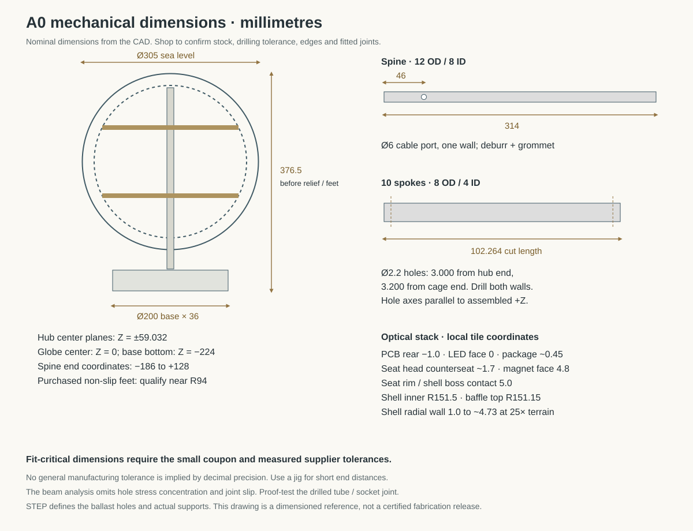
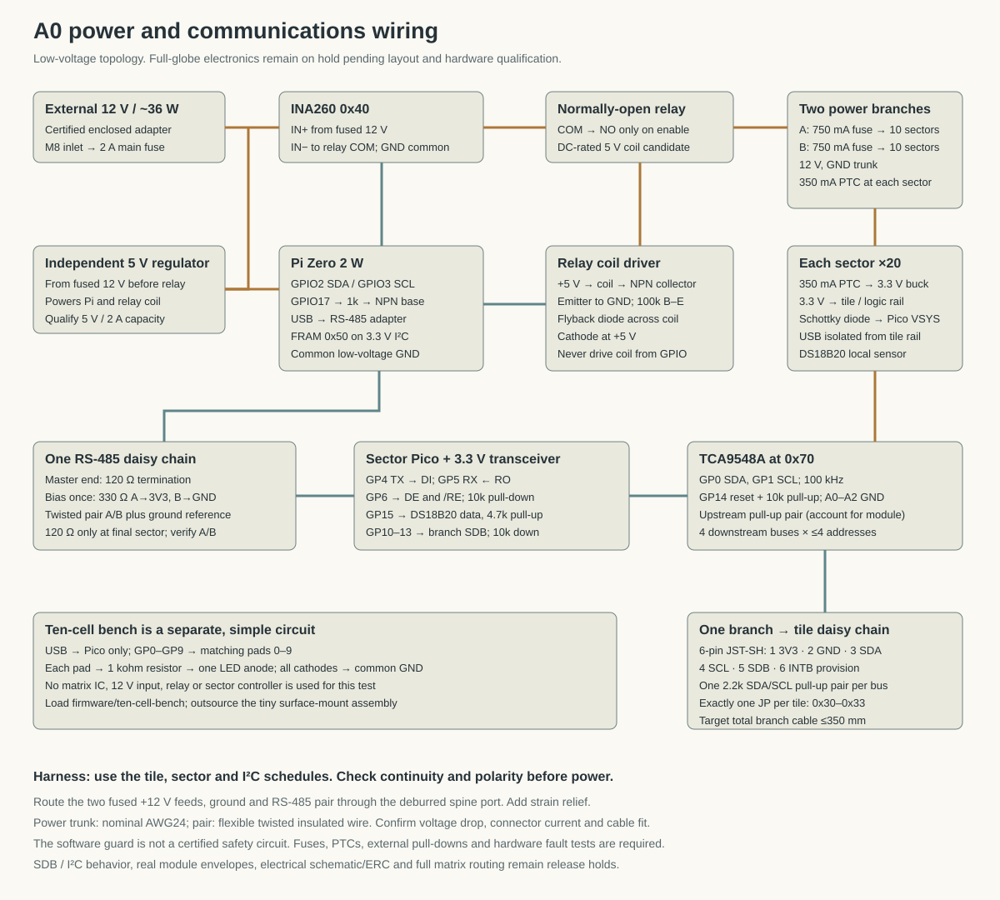

# Travel globe — engineering prototype A0

A 305 mm travel globe with 25× terrain and approximately 50-mile illuminated footprints. This release contains actual CAD, a fitted optical prototype, a routed test PCB, controller software, and reproducible engineering checks. **The complete globe is not yet released for fabrication.** The dense matrix boards still have unrouted connections, the south-polar support region needs a coverage revision, and the real optical finish has not been tested.

[Open the actual CAD assembly](engineering.html) · [Download the engineering package](engineering-package.zip) · [Travel appearance simulator](index.html)

## What exists, and what the evidence means

| Item | Status |
|---|---|
| Cage, stand, hubs, spokes, shell panels, baffles, controller carriers, prototype cradle | Parametric source and closed manufacturing meshes generated; assembly checks run |
| Terrain | Real sampled elevation, physically displaced at 25×; smooth inner sphere |
| Ten-cell optical test board | Routed; KiCad reports **0 violations and 0 unconnected items**; Gerbers, drills, BOM and placement file included |
| Six full-globe matrix board shapes | Placement, electrical connectivity and channel maps generated; **routing incomplete — do not order** |
| Mechanical simulation | Linear beam screening with a 3.5 kg supported mass; rigid-joint assumption |
| Thermal simulation | Two-node heat-balance estimate; no calibrated CFD or measured prototype temperatures |
| Optical simulation | Geometric apertures and parameter sensitivity; no measured resin, paint or LED data |
| Device software | 14 automated tests passed, including simulated transactions, interrupted storage, CRC errors and shutdown faults |
| Browser CAD viewer | Desktop and phone controls tested; reads actual generated meshes |
| Physical assembly, light output, print fit, component pinout/current, electrical commissioning | **Not performed** |

The CAD viewer is an inspection tool. Its colors are material illustrations; it does not certify the finished globe's brightness or surface appearance. The travel simulator remains an ideal appearance preview.

## 1. Architecture and scale

At this scale, 50 miles is **1.926 mm of surface radius**, or **3.852 mm across**. A 2 mm planar LED grid becomes slightly wider at the spherical surface. A visited city is consequently a small group of cells, often one to five commanded emitters. Two nearby visits can merge. There are no connecting route lines and no country-wide fill.

The structure uses a frequency-four icosahedral lattice: 320 triangular tile positions, 162 frame nodes and 480 struts. Detailed Natural Earth coastlines select **226 populated tiles containing 33,406 emitters**. Six repeated PCB/baffle shapes cover these positions. Many emitters on coastal boards remain off. The denser coastline data adds small-island coverage that the earlier coarse mask missed.

Twenty removable terrain panels correspond to the original icosahedron faces. Eight PA12 cage sections bolt together around a central aluminum spine. Ten aluminum spokes connect two split hubs to the cage. Twenty service carriers hold the sector electronics inside the cage. A weighted base supports the spine without bearings or a motor.

| Nominal parameter | A0 value |
|---|---:|
| Sea-level outside diameter | 305 mm |
| Smooth shell inside radius | 151.5 mm |
| Terrain exaggeration | 25× |
| Maximum sampled relief | Approximately 3.73 mm |
| Shell radial thickness | 1 mm at sea level, up to approximately 4.73 mm under the highest sampled relief |
| PCB corner radius | 144.5 mm |
| PCB thickness | 1 mm |
| LED pitch / optical opening at board | 2 mm / 1.6 mm |
| Optical wall thickness | 0.4 mm |
| Nominal baffle-to-shell clearance | 0.35 mm |
| Nominal minimum panel-edge separation | 0.5 mm |
| Cage vertex radius / strut diameter | 132 mm / 3.6 mm |
| Spine | 12 mm OD × 8 mm ID, 314 mm long |
| Spokes | 8 mm OD × 4 mm ID aluminum tube |
| Base body | 200 mm diameter × 36 mm high, before feet |
| Steel ballast | 150 mm diameter × 6 mm thick, approximately 0.819 kg |

All CAD coordinates use millimetres: +Z north, +X at latitude 0/longitude 0, +Y at longitude 90° east. The geometry lies in its assembled coordinate system unless the filename begins `prototype-` or identifies a reusable local tile part. Do not rescale STLs to inches.

## 2. Build the optical prototype first

This is the concrete first fabrication package, using tile 124 near Vancouver. It tests the real curvature, actual 2 mm lattice, magnetic seating and 25× terrain. Its simple ten-channel circuit avoids depending on the unfinished full-globe matrix PCB.

Order or make the following:

| Part | Quantity | Process |
|---|---:|---|
| `prototype-shell-vancouver-25x.stl` | 1 | Clear/translucent SLA resin; preserve the smooth inner optical surface |
| `prototype-shell-himalaya-25x.stl` | 1 | Same resin and finish; thicker-relief comparison coupon on identical curvature |
| `baffle-type-02.stl` | 1 | Opaque black SLA/DLP resin; qualify 0.4 mm walls and clean every cell |
| `prototype-cradle-type-02.stl` | 1 | PA12 preferred; a rigid print-service alternative is acceptable for this bench fixture |
| `magnet-seat-M2-4mm.stl` | 3 | PA12, with the supplied fit coupon |
| `magnet-fit-coupon.stl` | 1 | Same process as the seats |
| Optical bench PCB, 1 mm FR4 | Small service minimum | Supplied two-layer Gerbers/drills; outsource the 0402 LED and 0603 resistor assembly |
| 4 mm diameter × 2 mm magnets | 6 | Matched pairs; verify polarity before retention |
| M2 × 22 countersunk screws and M2 nuts | 3 each | The bench cradle has deeper nut pockets than the globe frame; confirm head geometry and engagement |
| Adhesive rubber feet, at least 2 mm thick | 4 | Under the cradle; keep projecting screw tips clear of the table |
| Raspberry Pi Pico, USB cable, fine insulated wire | 1 set | Bench control; no 12 V supply is used in this test |

The bench BOM names **Kingbright APHHS1005SYCK as a candidate** amber/yellow 1005 LED. Its current manufacturer datasheet and polarity must be confirmed by the assembler. A nominal package name alone is not enough to approve substitution. The resistor is 1 kohm, 1%, 0603; RC0603FR-071KL is a suitable nominal specification. These components have not been physically tested here.

The bench board has only ten populated emitter positions. It cannot display arbitrary geography across the whole tile. The supplied Vancouver, Seattle, combined and individual-cell patterns use the selected positions. The cell spacing and optical stack are the same as the proposed full-globe design.

Assembly sequence:

1. Measure the print coupon's magnet pockets. Choose a retained fit that does not crack the part. Check baffle openings for cured resin or supports; do not coat or fill them.
2. Inspect the assembled PCB under magnification. Have the service verify cathode orientation. With power disconnected, confirm that no solder pad has a direct short to ground and that each drive pad reaches its LED through a 1 kohm resistor.
3. Connect board pad **0 to Pico GP0**, 1 to GP1, continuing through **9 to GP9**. Connect the board's GND pad to a Pico GND pin. The pad number denotes the GPIO, not the Pico's physical header-pin number. Solder from the rear and add strain relief to the cradle; do not pull on the small pads.
4. Install MicroPython on the Pico. Copy `firmware/ten-cell-bench/main.py` and `patterns.json` with Thonny. The initial power-on state is off. In Thonny's Shell run `import main; main.show('walk-0', 0.1)` and repeat through `walk-9`. Check every expected cell before fitting the shell.
5. Seat three nuts in the cradle, install the PCB and magnet seats, and lightly seat the M2 × 22 screws. Fit the rubber feet so the screw tips cannot touch the table. The globe frame uses shorter M2 × 14 screws; do not interchange them. Use the printed post height to support the board; do not flex it to make a screw engage. Stop if the head or nut binds.
6. Fit the black baffle at its modeled position, with a nominal 0.1 mm bottom allowance above the PCB. Small removable dots at the outer edge may retain it. Keep adhesive out of cells and away from components.
7. Fit the magnets with paired polarity. The **5.0 mm seating rim** is the mechanical stop; the frame magnet face is recessed at 4.8 mm. The mating shell boss seats on the rim, leaving a nominal 0.2 mm magnetic gap. Qualify removable retention before relying on the magnets to carry a panel.
8. Test the uncoated shell first: `main.show('vancouver', 0.1)`, then `seattle`, then `both`. A PWM level of 0.1 is a starting point, not a calibrated brightness match. `main.show('off', 0)` turns it off. The selected bench pattern is saved for restart.
9. Apply a controlled transparent charcoal/smoke finish to a flat coupon and one shell. Start with a thin coat; record the product, dilution, number of coats and cure. An opaque black paint can make this design unusable. Compare a matte clear topcoat separately.
10. Repeat with the raised Himalaya coupon. Inspect whether thick relief becomes too dim or spreads light between cells. Keep fixed camera exposure when comparing samples.

The GPIO outputs are current-limited by the series resistors. **Never connect this passive test board to the globe's 12 V rail.** Its power comes from the USB-powered Pico's logic outputs. Outsourcing the tiny surface-mount assembly keeps the user's work to basic soldering and mechanical assembly.

## 3. Optical acceptance criteria

Do not infer optical success from the browser. The deep black cells reject most off-axis LED light. The Monte Carlo study predicts roughly percent-level direct passage through representative channels; measured LED intensity and finish transmission determine whether the result is attractive.

The shell's smooth inner surface makes the baffles repeatable but gives raised mountains a thicker light path. The absorption sweep quantifies the risk: increasing thickness from 1 to 4.73 mm leaves approximately 83%, 47%, 15%, or 2% of the flat-region transmission for assumed absorption coefficients of 0.05, 0.2, 0.5, or 1.0 per mm. **Those coefficients are examples, not measured resin properties.** Clear resin with a controlled outer tint is the starting material hypothesis.

Record these results in the supplied test log:

- At normal home viewing distance, Vancouver is a recognizable local patch and the neighboring unvisited cells stay dark enough to preserve its location.
- Vancouver and Seattle can be recognized separately, and together create an understandable combined area without implying all of Canada is visited.
- Individual lit cells do not make the entire shell glow. As an initial measurable target, the brightest adjacent uncommanded cell should stay below 15% of the commanded cell under fixed exposure.
- A finished, unlit coupon looks charcoal rather than translucent white. The illuminated finish reads warm amber in the intended room lighting.
- Raised terrain remains visibly lit. A starting comparison target is at least 40% of the nearby flat-region brightness before deciding whether electronic compensation is needed.
- The baffle fits without pushing the shell outward. The seating rims, not the baffle walls, carry the shell.
- Record DC current, PWM setting, warm-up time and surface temperature for each comparison. Assess by eye as well as photographs; an attractive display is the purpose of the test.

If these fail, change resin/finish, optical opening, cell height or emission current and rerun the small test. A conformal thin-wall terrain shell is a possible later redesign, but it is **not** what these CAD files contain. After the small test passes, print **one full-size terrain panel** to check warpage and seam fit before ordering all twenty.

## 4. Full-globe mechanics and assembly

Use SLS/MJF PA12 for the cage, hubs, base parts and controller carriers. Material properties in the structural model are assumed lower-bound values, not print-service certification. The optical shell and baffle need different materials and finishing processes. Do not substitute opaque nylon for a light-transmitting shell.

The cage is split across three coordinate planes with a 0.05 mm modeling gap and twelve bolted side flanges. Unsupported sub-0.6 mm seam remnants are explicitly relieved and recorded in the mesh audit. PCB posts accept bottom-loaded M2 nuts; their support rods continue into the post above the nut recess. Bolt bores clear the projecting screw tips.

The purchased metal parts require cutting and drilling. The spine's 6 mm cable-exit port is **46 mm above its lower end**, through one wall. Deburr it and fit abrasion protection. The base collar has an annular shoulder that carries the tube and a central wire passage. Spoke cut lengths and cross-hole centers come from the STEP/drawing files; use a drill jig to keep the two end holes aligned. The 8/4 mm spoke tube was selected to increase margin around the drilled joints.

`metal-cut-list.csv` records the 102.264 mm nominal spoke length and the two cross-hole positions. Decimal precision describes the model, not a guaranteed manufacturing tolerance. The short distance from each hole to the tube end needs a drilled-joint proof test. Confirm fit before drilling all ten tubes.

Dry-assemble in this order: ballast and base; spine and two split hubs; ten spokes; eight cage sections; controller carriers; wiring trunks; populated PCB tiles; local optical baffles; magnet seats; terrain panels. Keep the base lid accessible until commissioning is complete. Install electronics and prove the light patterns before closing the shell.

The controller carriers have open saddles facing the cage. Push each onto its specified struts from inside, then retain it with 2.5 mm cable ties. Their 60 × 40 mm perfboards are double-sided assemblies: Pico inward, regulator/mux/transceiver outward. Module envelopes are reservations, not verified supplier STEP models. Clip and insulate solder leads so they cannot contact the Pico or cage. Verify actual purchased module dimensions before populating all twenty carriers.

Each populated tile has three supports. Ordinary PCB screws use the 1 mm head spacer to keep the head above the LED packages. At shell anchors, the magnet seat replaces this spacer. Anchors on an unpopulated ocean tile use a 1 mm dummy spacer in place of the absent PCB. There are sixty shell anchors in total. Preserve access to the screw beneath each magnet: qualify a removable retention method, not an irreversible fill of the screw cavity.

The nominal 0.5 mm panel seams and 0.35 mm baffle clearance are tolerance allowances. Confirm them against the service's cured dimensions, not just printer layer height. The three seating rims establish each shell panel's radial position. Magnetic friction and retention still need pull and service-cycle tests. Do not tighten a panel into place by bending it.

## 5. Electronics and wiring

The full-globe architecture uses a Pi Zero 2 W in the base, twenty Pico sector controllers, one TCA9548A multiplexer per sector, and an IS31FL3741 per populated tile. Each sector has four independent I²C branches with at most four tile addresses. `tile-schedule.csv` specifies every tile, board shape, multiplexer branch and address jumper.

**The full matrix boards are unfinished engineering candidates.** Their pad-level netlists and placement files are included for review; full-globe Gerbers are deliberately absent. R_EXT is a provisional 2.2 kohm reference value and the firmware starts with current code 4. Current codes are not milliamps. Confirm the manufacturer specification, actual scan behavior, shutdown-pin behavior, thermal path and measured current before changing the current setting or releasing a batch.

| Tile connector pin | Signal |
|---|---|
| 1 | Local regulated 3.3 V |
| 2 | Ground |
| 3 | SDA |
| 4 | SCL |
| 5 | Branch SDB shutdown |
| 6 | INTB, open-drain diagnostic provision; not used by A0 control software |

Both tile connectors carry the same signals. Use precrimped 6-way JST-SH leads; confirm pin numbering at both ends rather than trusting wire colors. Bridge **exactly one** address jumper: JP1 = 0x30/GND, JP2 = 0x31/SCL, JP3 = 0x32/SDA, JP4 = 0x33/3.3 V. Address-to-SCL/SDA selection is a property of this IC; do not apply this scheme to an arbitrary replacement driver.

| Sector Pico connection | Destination |
|---|---|
| GP0 / GP1 | TCA9548A SDA / SCL, 100 kHz |
| GP14 | TCA reset; active low, held high in normal operation |
| GP10–GP13 | SDB for mux branches 0–3 |
| GP4 / GP5 | RS-485 transceiver DI / RO, UART1 at 115200 baud |
| GP6 | Joined DE and active-low RE |
| GP15 | DS18B20 data, 4.7 kohm pull-up to local 3.3 V |
| VSYS | Local supply through a Schottky isolation diode |
| GND | Common low-voltage ground |

Use a **3.3 V MAX3485/SP3485-class transceiver**, not a 5 V MAX485 module. A TCA9548A breakout such as Adafruit 2717 is a candidate; account for its installed pull-ups. Use one 2.2 kohm pull-up pair on each downstream branch and one upstream pair, rather than allowing every tile to add another pair. The harness schedule provides a wiring order and length allowance; confirm total branch length below the 350 mm design target and measure rise time during commissioning.

Use a 12 V trunk with local regulated 3.3 V converters; a D24V10F3-class module is the candidate envelope. Feed a Pico's VSYS through a Schottky diode so connecting USB cannot drive the shared 3.3 V LED rail backward. Flash and configure Picos with tile harnesses disconnected. Each sector input has a 350 mA PTC. Two base fuse branches, nominally 750 mA each, feed the twenty sectors. The current sensor and normally-open relay control the lighting branches, not the Pi's own supply.

RS-485 is one daisy chain. Terminate only its two physical ends with 120 ohms: the master end and the last sector in `sector-harness.csv`. Install the idle bias once at the master, nominally 330 ohms from A to 3.3 V and 330 ohms from B to ground. Include a ground reference with the twisted pair. Check the particular transceiver's A/B naming and idle receiver level before connecting all sectors.

The base uses a certified external 12 V, approximately 36 W adapter, a fused DC inlet, a separate 5 V Pi regulator, and a normally-open relay switched by a transistor with a flyback diode. A G5Q-1A4-DC5-class relay is the candidate mechanical envelope. The Pi drives its transistor through a resistor from GPIO17, with an external base/gate pull-down so boot or shutdown leaves the relay off. The relay must be rated for the actual DC load. A 2 A main input fuse and protected branches remain necessary independently of software.

An INA260 at Pi I²C address 0x40 monitors the 12 V lighting branch. The software latches off above 12 W, above 1.2 A, outside 10.8–13.2 V, on invalid readings, or on sensor failure. A separate thread monitors it during slow display updates. A local DS18B20 in every sector prevents operation without a valid reading and blanks that sector at 50 °C. Sensor placement must follow the hottest measured location, not just the easiest mounting point.

The current sensor is upstream of the normally-open relay so it can measure supply voltage before enabling the load. External pull-downs hold the relay transistor, SDB pins and RS-485 DE low during reset. An OS hang is not covered by a certified hardware watchdog; that fault must be tested and may require an independent watchdog. The base electronics tray still needs a qualified retention method, actual module fit and cable strain relief. The drawing is a wiring topology, not an ERC-checked full-system schematic.

## 6. Persistent records and phone control

The physical-device service runs on the Pi on the home network. Open its local address from a phone or computer and enter the device key stored on that Pi. Add a place by name and coordinates, set the footprint radius, and save. The default radius is 50 miles. JSON import/export supports a separate backup. The public GitHub site is a viewer, not a connection to a powered globe.

`firmware/install/README.md` includes desktop simulation, Pi provisioning, the systemd service, Pico file placement, configuration checks and recovery instructions. The A0 service is for the trusted home LAN; it has not been deployed on a physical Pi in this work.

SQLite uses WAL journaling and synchronous FULL commits. Writes require the current revision to prevent two windows silently overwriting one another. The latest project is rendered again after startup. The Pi also writes a two-bank MB85RC256V-class 32 kB FRAM recovery record at I²C address 0x50. CRCs and a final commit marker reject interrupted records. Acknowledgment follows the recovery write's readback verification.

FRAM preserves up to 2,000 coordinate pairs, radius and brightness. Names and history remain in SQLite and the exported JSON. If recovery from FRAM is needed after SD-card corruption, the coordinates return with generated names. Use an endurance SD card and retain an independent export. Automated tests simulate process termination and interrupted byte writes; they do not replace repeated physical unplug/restart tests on the selected SD card and FRAM module.

The wire protocol includes a CRC, revision number and bounded payload. A sector displays a frame only after receiving every configured tile for that revision. Stale updates and an incorrect pixel-map digest are rejected. Loss of host contact blanks the sector after sixty seconds; the stored travels are retained. This is a display-fault response, not deletion of the user's record.

The physical renderer samples open cell area and includes mounting shadows. A minimum local mark prevents a small visit disappearing beside a post. This can place the nearest illuminated cell within approximately 90 miles at the 50-mile setting. It does not illuminate an entire country. Unsupported places are reported explicitly. **A0 excludes the south-polar support tiles; it does not yet provide continuous Antarctic coverage.** The geographic diagnostic is not a measure of the percentage of Earth explored.

## 7. Mechanical, thermal and geographic results

The final 8/4 mm spoke model uses a 3.5 kg supported load against an estimated approximately 3.15 kg component mass. It predicts about **0.16 mm maximum displacement under gravity**, **0.48 mm under a static 3g load**, and **0.90 mm with gravity plus a 5 N side load at the north pole**. Maximum nominal aluminum beam stress is approximately 25.7 MPa in the 3g case. These are model outputs, not measured deflections.

The solver reproduces the independent cantilever formula for a 100 mm aluminum tube under a 1 N end load. Equilibrium residuals are checked. It assumes tight, rigid joints and omits local holes/notches, bolt preload/slip, print anisotropy, nonlinear impacts, and long-term creep. Those omissions are why the report does not claim a validated drop rating or certified safety factor.

The idealized ballast/base calculation gives approximately 29° static tip angle and roughly 11.5 N top-side force to tip, before measured mass distribution and floor friction replace the assumptions. Use non-slip feet near the base perimeter. Test tipping gradually with the prototype supported against a fall.

The thermal estimate uses 12 W inside the globe in a 30 °C room. It predicts approximately **40 °C interior and 35 °C outer surface** under the stated convection/radiation assumptions. A poorer heat-transfer case reaches approximately **47 °C inside**. Local component hot spots, sunlight and measured material emissivity are not resolved. Run instrumented warm-up and fault tests before accepting a 50 °C shutdown threshold or leaving the finished display powered unattended.

The city study uses Vancouver, Seattle, New York, Chicago, Los Angeles, Sioux Falls, London, Tokyo, Sydney, Reykjavik, Honolulu, Singapore and Kathmandu. The revised sampling commands at least one local cell for every example. The report also records the substantial polar coverage limitation; it is not hidden by the successful city examples.

## 8. Budget and procurement

The confirmed budget is **$1,500–$4,500**. This design targets the upper end. `budget-allowances.csv` allocates exactly $4,500, including $250 for the optical prototype and $550 contingency. **These are procurement ceilings, not supplier quotes.** The largest ceiling is $1,700 for all 226 assembled LED boards; whether a supplier can meet it with qualified components is unproven. A complete build at $1,500 is not established by this design.

Request a quote using the actual part counts, material requirements and fabrication files. Do not send the incomplete matrix candidates as manufacturing Gerbers. Ask print services to quote the baffles nested in batches, verify 0.4 mm walls, specify cured dimensional tolerances and state whether optical surfaces can be supplied without support scars. Price the finish and sample failures separately from raw printing.

The package includes `electronics-and-hardware-bom.csv`, `parts-manifest.csv`, `metal-cut-list.csv`, `tile-schedule.csv`, `sector-harness.csv`, `i2c-harness.csv`, `budget-allowances.csv` and `acceptance-worksheet.csv`. Candidate modules and nominal screw lengths require fit review; they are not a prequalified shopping cart.

Release gates are: the ten-cell optical/fit test; one full panel and frame-joint test; completed matrix routing/ERC/DRC and first-board electrical test; a working sixteen-tile sector; measured full-system power/thermal and persistence tests; then full assembly. If quotes or optical results exceed the budget, the design has to change before the production batch.

## 9. Qualification record and service

The included acceptance worksheet gives a place to record measured results. Minimum checks include individual-cell mapping and polarity; repeated shell removal; screw/nut fit; spoke and cage-joint proof loading; two-hour warm-up at maximum commissioned command; disconnected/invalid temperature sensor; lost RS-485 host; unplugged current sensor; a protected-branch fault using a current-limited bench supply; and repeated saves followed by power removal/restart.

For the full globe, require all mechanical intersections to be resolved, all board DRC/ERC items reviewed, every physical tile label to match the schedule, and every sector to pass its cell-walk pattern. A clean PCB DRC proves layout rules and connectivity, not part suitability or firmware correctness. A watertight STL proves mesh closure, not that a service can print a 0.4 mm wall successfully.

Keep the source, pixel-map checksum, sector configuration, travel backup and measured calibration with the object. The shell and lighting are separate: adding a destination changes stored data and PWM values, so the terrain does not need reprinting. Disconnect power before replacing a tile or removing the base. Preserve the tile's identifier and address jumper when fitting a replacement.

## 10. Files and reproducibility

The download includes parametric CAD source, STL parts, checked STEP exports where available, assembled geometry, engineering result JSON/figures, the ten-cell manufacturing pack, unfinished matrix candidates in a clearly marked hold folder, firmware, wiring schedules, and test instructions. Cage STEP exports are faceted boundaries; the Python source is the editable dimensional definition. A STEP that fails round-trip validation is excluded; its independently checked STL remains available.

Use `docs/cloud-setup.md` and `tools/build-design.sh` for the environment and build order. The simulator is built with `npm run build`; geometry checks use `npm test`; device tests use Python's unittest discovery. Rebuilds must regenerate the pixel-map checksum and all twenty sector configuration files together. Do not mix a firmware configuration from one map with board/channel files from another.

Elevation and shoreline provenance, the Adafruit reference attribution, KiCad library terms and other third-party notices are included in the package. This release does not claim that a physical globe has been printed, assembled, or tested.
